<div align="center">

# Scratch Tribology Simulator

**What scratches, cuts, punctures or breaks what — and why.**

An educational contact-mechanics and tribology laboratory. Human nails, animal claws and viper fangs
are tested against materials from human skin to diamond, using published physical models and
measured data. Every number the app shows comes from an equation you can look up.

[](https://github.com/AcidClawX41/Scratch-Tribology-Simulator/actions/workflows/ci.yml)
[](LICENSE)

macOS (Apple Silicon & Intel) · Windows · Linux · iPhone & iPad · Android · Web

</div>

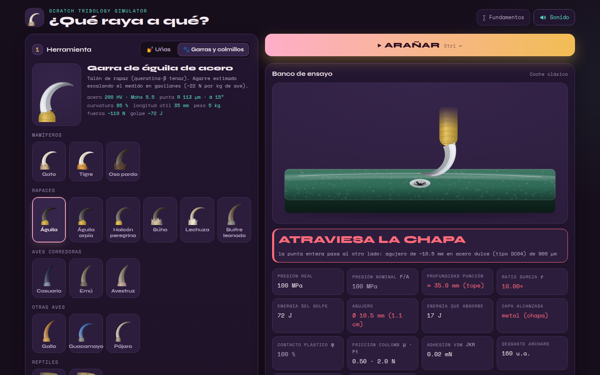

<sub>The real app build (the interface the Tauri desktop app shows), rendered in Chromium. An eagle talon
reforged in steel strikes a classic car with 72 J. The talon passes all the way through 0.9 mm of mild steel and leaves a
10.5 mm petalled hole. The panel absorbs 17 J of the strike. The user interface is in Spanish.</sub>

---

## Contents

- [What the app does](#what-the-app-does)
- [The physics: models and equations](#the-physics-models-and-equations)
- [Materials, tissues and tools](#materials-tissues-and-tools)
- [What the model predicts](#what-the-model-predicts)
  - [Decision paths, case by case](#decision-paths-case-by-case)
- [Screenshots](#screenshots)
- [How the physics is verified](#how-the-physics-is-verified)
- [Download](#download)
- [Build from source](#build-from-source)
- [Project structure](#project-structure)
- [Known limitations](#known-limitations)
- [License](#license)
- [Author](#author)

---

## What the app does

Pick a **tool**, a **material** and a **test method**, then press *ARAÑAR* ("scratch"). The engine
works out the contact pressure, whether the tip can scratch at all, how deep it goes and which layer
gives way. Everything is drawn and, if you want, heard.

| | |
|---|---|
| **Tools** | 6 nail shapes, from a square nail (9 mm² tip) to an extra-long Stiletto XL (0.08 mm²). 3 salon materials (natural keratin, UV gel, acrylic). 4 experimental solid nails (stainless steel, titanium, sapphire, diamond). 12 embedded stones, from gold leaf to diamond. 17 claws and fangs: cat, tiger, brown bear, eagle, harpy eagle, peregrine falcon, owl, barn owl, griffon vulture, cassowary, emu, ostrich, rooster spur, macaw, small bird, viper and Gaboon viper. Any claw can be *reforged* in steel, tungsten carbide, sapphire, diamond… (same shape, new material) |
| **Materials** | 17 targets: layered human skin, pine, a varnished oak door, an aluminium house door, someone else's nail, ABS plastic, four cars (modern steel, classic steel, aluminium, plastic wing), a copper coin, window glass, stainless steel, a phone screen, a quartz countertop, sapphire crystal and diamond |
| **Methods** | Scratch (drag) · hooked claw tear (lever) · static puncture or injection · 💥 strike (kinetic energy) · 1–100 passes over the same groove · light, normal or deep scratch · dry or soaked keratin |
| **Results** | Verdict with the layer reached, depth, width, real vs nominal pressure, hardness ratio, plastic fraction, abrasion mode, scratch friction, Archard wear, JKR adhesion, strike energy and energy absorbed. On skin: whether it bleeds. On glass: the force that breaks the pane |
| **Views** | Animated test bench with textured materials. Cross-sections of skin, car paint and body, and the oak door. Profile of the groove or hole. The whole catalogue compared on the same material. **Dual mode**: the same test on an old and a modern car, with a damage report in millimetres and centimetres. 15 lab achievements, a lab notebook and an in-app *Fundamentals* panel |
| **Sound** | 22 synthesized effects (scratch, cut, puncture, shattering glass…), toggleable. Haptics on phones |

---

## The physics: models and equations

All physics lives in [`packages/core`](packages/core), plain JavaScript with no dependencies,
shared by the desktop and mobile apps. The apps only draw results; they never recompute physics.
Units: force in N, pressure and hardness in MPa (1 HV = 9.807 MPa), depth in µm or mm, energy in J.
Every constant has a published source, or is flagged as an **estimate**, in
[`docs/FISICA.md`](docs/FISICA.md) (model v2.4, 55 references, in Spanish).

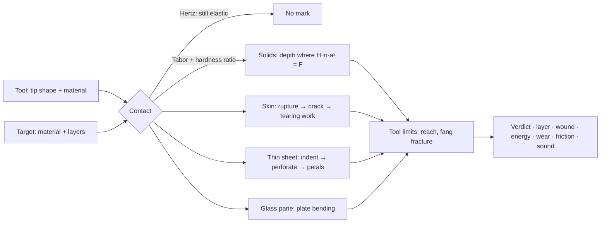

Every model the engine uses, what it does and where the numbers come from:

| # | Model · equation | How the force acts | In the app · sources |
|---|---|---|---|
| 1 | **Sphero-conical tip**<br>$`R=\sqrt{A/\pi}`$<br>$`a=\sqrt{2Rh-h^2}`$ while $`h\le h_t=R(1-\sin\alpha)`$<br>$`a=R\cos\alpha+(h-h_t)\tan\alpha`$ beyond | The load is carried by a contact patch of radius *a* that grows as the tip sinks to depth *h*. A blunt tip stays on its spherical cap, where depth grows with the force. A sharp cone reaches its flank almost at once, where depth grows only with √F but from a tiny area. At equal force, the sharper tip goes much deeper: **geometry beats force**. | Every nail shape, claw and fang; tip radius *R* and half-angle α on each tool card · Johnson (1985) |
| 2 | **Nominal vs real pressure**<br>$`P_\mathrm{nom}=F/A`$<br>$`P_\mathrm{real}=\min(P_\mathrm{nom},\,H_\mathrm{tool},\,H_\mathrm{target})`$<br>$`H\approx 2.8\,Y`$ | A sharp tip "asks" for F/A, often several GPa. In plastic contact the mean pressure can never exceed the hardness of whichever body yields. Extra load just widens the contact, or flattens the tip. | *Presión real / nominal* metrics · Tabor (1951) |
| 3 | **Elastic threshold (Hertz)**<br>$`\frac{1}{E^*}=(1-\nu^2)\left(\frac{1}{E_1}+\frac{1}{E_2}\right)`$<br>$`a_H=\left(\frac{3FR}{4E^*}\right)^{1/3}`$, $`p_0=\frac{3F}{2\pi a_H^2}`$<br>yields when $`p_0\sqrt{1+3\mu^2}\ge 1.6\,Y`$ | Before leaving any mark, the contact is elastic and springs back, however hard the tip. Sliding friction adds shear (the von Mises factor √(1+3μ²)) and so starts yielding earlier. The plastic fraction φ rises smoothly from 0 to 1. | Contact φ. It explains why a blunt diamond nail slides over quartz at 30 N while a Stiletto XL scratches it · Johnson (1985) |
| 4 | **Who yields: hardness ratio**<br>$`r=\mathrm{HV_{tool}}/\mathrm{HV_{target}}`$<br>$`r<0.8`$: the tip wears · $`r<1.25`$: faint mark<br>$`\eta(r)=\mathrm{smoothstep}(0.8,\,2,\,r)`$, effective hardness $`H/\eta`$ | A point scratches a surface only if it is about 1.2 times harder. Otherwise the point is what wears. Between those limits the tip blunts as it cuts. The saturation at *r* ≈ 2 is a model hypothesis. Mohs is ordinal and only used as a label. | Hardness ratio *r*, verdicts *NO RAYA* and *MARCA TENUE* · Tabor (1954); Richardson (1968); Pintaude (2021) |
| 5 | **Depth of a groove or pit**<br>solve $`F=\frac{H}{\eta}\,k\,\pi\,a(h)^2`$<br>$`k=1`$ (puncture), $`k=\tfrac12`$ (scratch) | Plastic flow stops where hardness × load-bearing area balances the force. When scratching, only the front half of the contact carries load. Heuristic multipliers, labelled as such: plastic fraction φ, scratch type (0.55 / 1 / 1.7), repeated passes $`n^{0.4}`$, hooked-claw lever $`1+1.3\,c`$. | Depth, width, groove profile · Tabor (1951); ASTM G171 |
| 6 | **Car paint on a car body**<br>$`H(h)=H_\mathrm{paint}`$ for $`h\le 110\ \mu\mathrm{m}`$, then $`H_\mathrm{body}`$ | OEM paint is a soft polymer stack of about 20 HV: clearcoat 45 µm, basecoat 15, primer 25, e-coat 25. A keratin claw ploughs through it but stalls on steel or aluminium, where *r* ≈ 0.3: *HASTA EL METAL* ("down to the metal"). The tip stays blunted by the hardest layer it has cut. A plastic wing is softer than the clearcoat, so claws dig in. | Four cars; paint and body cross-section · Vodnick (2006); body data below |
| 7 | **Hard coating on a soft substrate**<br>$`H=H_\mathrm{wood}+(H_\mathrm{lacquer}-H_\mathrm{wood})\,e^{-a/t}`$ | A 30 µm hard lacquer on soft oak sinks with the wood (the eggshell effect). Its share of the load fades once the contact is wider than the film is thick, so cracking the lacquer never makes the depth jump. | Varnished oak door · Jönsson & Hogmark (1984), simplified |
| 8 | **Breaking the skin**<br>$`F_p=190\ \mathrm{N/mm^2}\cdot A-0.66\ \mathrm{N}`$ (≥ 0.08 N)<br>strike: $`E\ge G_p\,A`$, $`G_p=30.1\ \mathrm{kJ/m^2}`$<br>drag: $`F_\mathrm{eff}=N\sqrt{1+3\mu^2}\cdot\mathrm{hook}\cdot\mathrm{lever}`$ | The surface is the hardest part of skin to breach. The force grows with the tip area: a needle-sharp fang needs less than 1 N, a blunt nail about 170 N. Dragging a tip breaks skin more easily, because of shear and the tension in the skin ahead of it. | *Fuerza para romper la piel* · Davis et al. (2004), in vivo; Knight (1975) and Green (1978) via Ankersen (1999) |
| 9 | **Deep penetration of tissue**<br>$`F=2\,J_C\,a(h)`$ with the cutting toughness $`J_C`$ of the layer at the tip<br>first equilibrium where resistance **drops** at a boundary | Once through the dermis, the tip wedges open a flat crack. Fat, fascia and muscle resist far less, so the tip runs on until a layer stops it or its full length is buried. A viper fang pushed with only 4 N delivers its venom intramuscularly. | Puncture depth and layer (subcutaneous or intramuscular) · Shergold & Fleck (2005); Pereira et al. (1997); O'Callaghan et al. (1999) |
| 10 | **Tearing and lacerations**<br>$`F_t=\int_0^h J_T(z)\,\mathrm{d}z`$<br>$`F_t=\mu F\cdot\mathrm{hook}`$ (drag) or $`F\cdot\mathrm{lever}`$ (hooked tear) | A claw that has broken the skin opens a cut as deep as the tearing work per millimetre it can pay. The tearing toughness is 17 kJ/m² for dermis, 4.1 for fat, 2.1 for fascia and 0.84 for muscle. Without a rupture there is only abrasion: a white line where the stratum corneum lifts, or scratches where the epidermis comes off, which bleed only after repeated passes. | White scratch → scratches → bleeding scratch → deep scratch → laceration → muscle tear · Comley & Fleck (2010); Kim et al. (2001); Aryeetey et al. (2022) |
| 11 | **Impact**<br>$`\tfrac12 m v^2+F\,h=\int_0^h F_\mathrm{res}\,\mathrm{d}h`$ | A strike brings kinetic energy, which is spent as penetration work. A sharp tip spends little per millimetre and goes deep. A blunt one spends it widening the hole. | 💥 Strike mode, strike energy and energy absorbed · speeds: Penning et al. (2016), Estrada et al. (2026); effective masses are estimates |
| 12 | **Thin-sheet perforation (petalling)**<br>$`E(l)=\sigma_0 t^2 l\left[1.23+8.9\,(l/t)^{0.4}\right]`$<br>$`F=\mathrm{d}E/\mathrm{d}h`$, $`\sigma_0=\sqrt{\sigma_y\sigma_u/(1+n)}`$ | First the tip indents paint and metal like a solid, which takes hardness. When it reaches the back face the sheet cracks: *PERFORA* ("perforates"). From then on the metal no longer resists as a block. The hole opens in petals that bend and tear, and its energy grows with the hole radius *l*. Pushing a whole claw through takes tens of joules: *ATRAVIESA* ("goes through"). Scratching hard enough slits the panel: *RAJA*. | Cars and the aluminium door; hole diameter · Wierzbicki (1999); Atkins et al. (1998) |
| 13 | **Hardness of the body panels**<br>$`H\approx 2.8\,\sigma(\varepsilon=8\%)`$<br>$`\sigma=K\varepsilon^n`$, $`K=\sigma_u\,(e/n)^n`$ | One recipe turns each alloy's tensile curve into a hardness: 101 HV for bake-hardening steel, 92 HV for mild steel and 71 HV for AA6016. The PPE/PA plastic wing uses $`H\approx 2.8\,\sigma_y`$ instead: 13 HV. | Car bodies · Tabor (1951); Hollomon (1945); steel, aluminium and polymer data sheets |
| 14 | **Window glass breaking in bending**<br>$`\sigma=\frac{3F}{2\pi t^2}\left[(1+\nu)\ln\frac{a}{r_0'}+1\right]`$<br>$`r_0'=\sqrt{1.6\,r_0^2+t^2}-0.675\,t`$<br>breaks at $`f_{g,k}=45`$ MPa, so F ≈ 197 N | Scratching glass needs hardness; breaking it does not. A load at the centre bends the pane, and the back face, in tension, reaches the glass's bending strength. A soft paw can break a window. | 4 mm annealed float glass, about 60 cm across · Roark (Young & Budynas 2002); EN 572-1 via Saint-Gobain (2018) |
| 15 | **Peak force of a strike on the pane**<br>$`k=\frac{4\pi E t^3}{3a^2(3+\nu)(1-\nu)}\approx 85`$ N/mm<br>$`k_\mathrm{eff}=\left(\frac1k+\frac1{k_\mathrm{limb}}\right)^{-1}`$, $`F_\mathrm{peak}=v\sqrt{m\,k_\mathrm{eff}}`$ | The soft paw acts as a spring in series with the pane and cushions the blow. A cat's swipe peaks at about 147 N and the window holds. A bear's swipe peaks at about 1,300 N and a stooping falcon's at about 1,900 N, and both break it. | Window results · Roark; limb stiffness 10 N/mm is an **estimate** |
| 16 | **Tool limits**<br>$`h\le\mathrm{reach}`$<br>fang fracture above 30 N (peak along the path)<br>hole radius ≤ base radius (0.15 × reach for claws, 0.04 × for fangs) | Nothing sinks deeper than its own claw or free nail edge, whether puncturing or scratching. Hydrated viper fangs snap near the tip at about 30 N, before they could ever break a window. | *(tope)* ("stop") on the depth, *SE ROMPE LA PUNTA* ("the tip breaks") · Estrada et al. (2026); base widths are estimates |
| 17 | **Wet keratin**<br>$`H,\ E\ \times\ 0.2`$ (natural nails and claws) | Keratin absorbs water: from 6 % moisture when dry to 64 % soaked. Its modulus falls from 2.34 to 0.47 GPa and its strength from 69 to 14 MPa, so a soaked nail barely scratches anything. Gel, acrylic, gems and dentine are unaffected. | *Húmeda* ("wet") toggle · Farran et al. (2008, 2009); Bonser via McKittrick et al. (2012) |
| 18 | **Abrasion mode**<br>$`D_p=h/a`$: ploughing < 0.1 < wedge < 0.2 < cutting | A blunt tip pushes material aside into ridges (ploughing). A sharp one lifts a chip (cutting). | *Modo abrasión* · Hokkirigawa & Kato (1988) |
| 19 | **Scratch friction**<br>$`\mu=\mu_\mathrm{adh}+\mu_\mathrm{plough}`$, $`\mu_\mathrm{plough}\approx 0.9\,D_p`$ | Friction while scratching is adhesion plus the force spent shoving material out of the way. For a sphere, Bowden and Tabor give about 0.85·*h*/*a*. Deep grooves are hard to drag. | *Fricción de rayado (SCOF)* · Bowden & Tabor (1950) |
| 20 | **Wear**<br>$`V\propto \frac{F\,L}{H}\,f_{ab}`$ | The softer body loses volume in proportion to load and sliding distance. The engine also scales it by the fraction actually removed: 2 % when merely polishing. | *Desgaste Archard* index (arbitrary units) · Archard (1953) |
| 21 | **Adhesion (van der Waals)**<br>$`F_\mathrm{adh}=1.5\,\pi R W`$ | Surface attraction amounts to millinewtons at this scale, negligible next to newtons of load. The app shows it to explain why geckos care about it and claws don't. | *Adhesión vdW (JKR)* · Johnson, Kendall & Roberts (1971) |

Full derivations, every data point with its source, the list of estimates and the 55 references are
in [`docs/FISICA.md`](docs/FISICA.md).

---

## Materials, tissues and tools

### Human skin, layer by layer

Reference site: the back of an adult's upper arm, where scratches and bites are typical. Soft tissue has no Vickers
hardness, so each layer is described by its thickness, its stiffness *E* and two toughnesses: $`J_T`$
for tearing and $`J_C`$ for cutting.

| Layer | Depth | *E* | $`J_T`$ tearing | $`J_C`$ cutting | Sources |
|---|---|---|---|---|---|
| Stratum corneum | 0–18 µm | — | as dermis | 1.7 kJ/m² | Sandby-Møller et al. 2003 (biopsies); Egawa et al. 2007 |
| Viable epidermis | 18–75 µm | — | as dermis | 1.7 kJ/m² | Sandby-Møller et al. 2003. No blood vessels: it doesn't bleed |
| Dermis | 0.075–2.2 mm | 210 kPa | 17 kJ/m² | 1.7 kJ/m² | Gibney et al. 2010 (ultrasound, 388 adults); Iivarinen et al. 2011; Comley & Fleck 2010; Pereira et al. 1997 |
| Subcutaneous fat | 2.2–13.0 mm | 1.9 kPa | 4.1 kJ/m² | 0.41 kJ/m²\* | Gibney et al. 2010; Comley & Fleck 2010 |
| Deep fascia | 13.0–13.3 mm | — | 2.1 kJ/m² | 0.21 kJ/m²\* | Stecco et al. 2009; Kim et al. 2001 |
| Muscle | > 13.3 mm | ≈ 53 kPa | 0.84 kJ/m² | 0.084 kJ/m²\* | Šarabon et al. 2019; Aryeetey et al. 2022 |

<sub>\* Estimates: the dermis's cutting toughness scaled by the ratio of tearing toughnesses. This agrees with the
classic cadaver finding that skin is by far the most resistant tissue and that what lies beneath gives way
easily (Knight 1975; O'Callaghan et al. 1999).</sub>

### Cars: same paint, different bodies

All four cars carry the same OEM paint: clearcoat 45 µm, basecoat 15 µm, primer 25 µm and e-coat 25 µm,
110 µm in total at about 20 HV. On plastic the e-coat is replaced by an adhesion promoter.

| Car | Body panel | Thickness | Hardness | Flow stress σ₀ | Sources |
|---|---|---|---|---|---|
| Modern | Bake-hardening steel HC180B (Rp0.2 180–230 MPa, +35 MPa after the paint bake, Rm 340 MPa, n ≥ 0.17) | 0.7 mm | 101 HV | 264 MPa | Nippon Steel 2013; voestalpine 2022; I-CAR |
| Classic | Mild deep-drawing steel, DC04-type (Re 140–210 MPa, Rm 270–350 MPa) | ~0.9 mm (estimate) | 92 HV | 214 MPa | ArcelorMittal B10 |
| Aluminium | AA6016 after the paint bake (Rp0.2 212 MPa, Rm 273 MPa, n 0.30) | 1.0 mm | 71 HV | 211 MPa | Hirsch 2011; Prillhofer et al. 2014 |
| Plastic wing | PPE/PA thermoplastic, Noryl GTX (yield 44–50 MPa, 1.8 GPa) | ~2.5 mm (estimate) | 13 HV | 47 MPa | SABIC; GE Plastics 2007 |

The aluminium house door (1.5 mm 6063-T5, 60 HV) uses the same thin-sheet physics. The window is
4 mm annealed float glass: 550 HV, 45 MPa characteristic bending strength.

<details>
<summary><b>Claws and fangs</b>: tip, length, force and strike</summary>

Grip forces for mammals and ratites are estimates from body mass and anatomy. Raptor grips are
scaled from the measured Cooper's hawk (Sustaita & Hertel 2010). Strikes split the limb's energy
between its claws. Viper speeds are measured (Penning et al. 2016); the fang's ~30 N fracture load comes from
Estrada et al. (2026).

| Claw / fang | Tip area · half-angle | Useful length | Force | Strike ½·m·v² |
|---|---|---|---|---|
| Cat | 0.02 mm² · 14° | 10 mm | 15 N | 4 m/s × 0.15 kg = 1.2 J |
| Tiger | 0.06 mm² · 16° | 40 mm | 260 N | 8 m/s × 3 kg = 96 J |
| Brown bear | 0.5 mm² · 26° | 60 mm | 300 N | 7 m/s × 4 kg = 98 J |
| Eagle | 0.04 mm² · 15° | 35 mm | 110 N | 12 m/s × 1 kg = 72 J |
| Harpy eagle | 0.06 mm² · 15° | 40 mm | 200 N | 9 m/s × 1.8 kg = 73 J |
| Peregrine falcon (stoop) | 0.02 mm² · 15° | 18 mm | 15 N | 40 m/s × 0.25 kg = 200 J |
| Owl | 0.03 mm² · 15° | 30 mm | 45 N | 6 m/s × 0.5 kg = 9.0 J |
| Barn owl | 0.015 mm² · 13° | 15 mm | 8 N | 5 m/s × 0.08 kg = 1.0 J |
| Griffon vulture | 0.3 mm² · 28° | 25 mm | 60 N | 2 m/s × 1 kg = 2.0 J |
| Cassowary (inner claw) | 0.05 mm² · 14° | 110 mm | 500 N | 8 m/s × 5 kg = 160 J |
| Emu | 0.12 mm² · 22° | 40 mm | 300 N | 7 m/s × 2.5 kg = 61 J |
| Ostrich | 0.35 mm² · 32° | 60 mm | 900 N | 10 m/s × 8 kg = 400 J |
| Rooster spur | 0.04 mm² · 16° | 25 mm | 40 N | 5 m/s × 0.4 kg = 5.0 J |
| Macaw | 0.03 mm² · 18° | 15 mm | 25 N | 1.5 m/s × 0.1 kg = 0.1 J |
| Small bird | 0.02 mm² · 16° | 4 mm | 1.5 N | 1 m/s × 0.01 kg = 0.005 J |
| Viper fang | 0.008 mm² · 17° | 18 mm | 4 N | 2.8 m/s × 0.35 kg = 1.4 J |
| Gaboon viper fang | 0.012 mm² · 15° | 50 mm | 20 N | 2.5 m/s × 1 kg = 3.1 J |

Nails: square 9 mm² · 75°, round 3.5 mm² · 65°, coffin 2.8 mm² · 55°, almond 0.9 mm² · 40°,
stiletto 0.15 mm² · 22°, Stiletto XL 0.08 mm² · 16° (free edge 4–12 mm). Natural nail: ~25 HV,
E 2.9 GPa (nanoindentation, Tohmyoh et al. 2023).

</details>

---

## What the model predicts

Computed by the engine itself, the same numbers the app shows. Many of these cases are locked in by
tests.

| Test | Result | Why |
|---|---|---|
| Almond nail, 4 N, skin | White scratch: lifts the 18 µm stratum corneum | Breaking skin with that tip would need ~170 N |
| Almond nail, 30 N × 20 passes, skin | Bleeding scratches (75 µm) | Repeated excoriation reaches the capillaries of the papillary dermis |
| Cat claw, 15 N, skin | Deep scratch, 0.69 mm, bleeds | The sharp claw breaks skin from 3.1 N |
| Cat claw, 15 N, hooked tear | Deep tear, 1.8 mm | The curved claw pulls with its whole force instead of just friction |
| Tiger claw, 260 N, skin | Deep laceration into muscle, 40 mm, the full claw (*tope*) | Past the dermis, fat and muscle tear with little work |
| Viper fang pushed with 4 N, skin | Puncture: venom at 18 mm, intramuscular | Needle tip: skin breaks at 0.86 N, then *F* = 2·*J_C*·*a* is small |
| Natural nail, 30 N, window glass | No scratch (*r* = 0.05) | Keratin (25 HV) against glass (550 HV): the nail wears |
| Diamond-set nail, 30 N, sapphire | 4.4 µm groove, wedge mode | *r* = 5 (10,000 vs 2,000 HV). A sapphire stone on sapphire (*r* = 1) only polishes: a faint mark |
| Diamond Stiletto XL, quartz: 4 N vs 30 N | Nothing (φ = 5 %) vs a 5.3 µm groove | Below the Hertz yield onset the contact is elastic |
| Square diamond nail, 30 N, quartz | Slides without marking (φ = 0 %) | A blunt tip spreads the load: geometry beats hardness |
| Almond nail on car paint, 30 N: dry vs soaked | 30 µm clearcoat scratch vs a polishable swirl | Soaked keratin keeps only ~20 % of its hardness |
| Bear claw, 300 N scratch: modern car vs plastic wing | Stops at the metal (110 µm) vs 1.0 mm into the plastic | Keratin can't cut steel (*r* ≈ 0.26); PPE/PA is softer than keratin |
| Steel-reforged eagle talon strike (72 J): classic, modern, aluminium car | Goes through all three: Ø 10.5 mm hole; the panel absorbs 17, 14 and 20 J | Petalling energy scales with σ₀·t²: thicker mild steel and aluminium cost more |
| Solid-metal stiletto nail jab (5 J): modern vs classic car | Perforates both: the tip exits 5.3 vs 4.3 mm; hole Ø 5.2 vs 4.6 mm | The thinner modern panel yields more easily |
| Swipe on a window: cat vs bear, and a falcon's stoop | Cat: the pane holds (147 N < 197 N). Bear (~1,300 N) and falcon (~1,900 N): it breaks | Peak force with the paw's stiffness in series |
| Viper fang pushed at 40 N against glass | The fang breaks (~30 N) | Fang fracture load (Estrada et al. 2026) |
| Kick on a 35 mm oak door: cassowary (160 J) vs ostrich (400 J) | Cassowary goes through (Ø 18.5 mm); the ostrich claw sticks at 25.5 mm | 14° dagger claw vs 32° blunt claw: sharpness beats energy |

### Decision paths, case by case

The same engine, drawn as the decisions it takes for each kind of target. The thresholds are the ones
in [`packages/core/src/physics.js`](packages/core/src/physics.js), and the lines in italics are results
from the table above.

#### Hard solids: who scratches whom

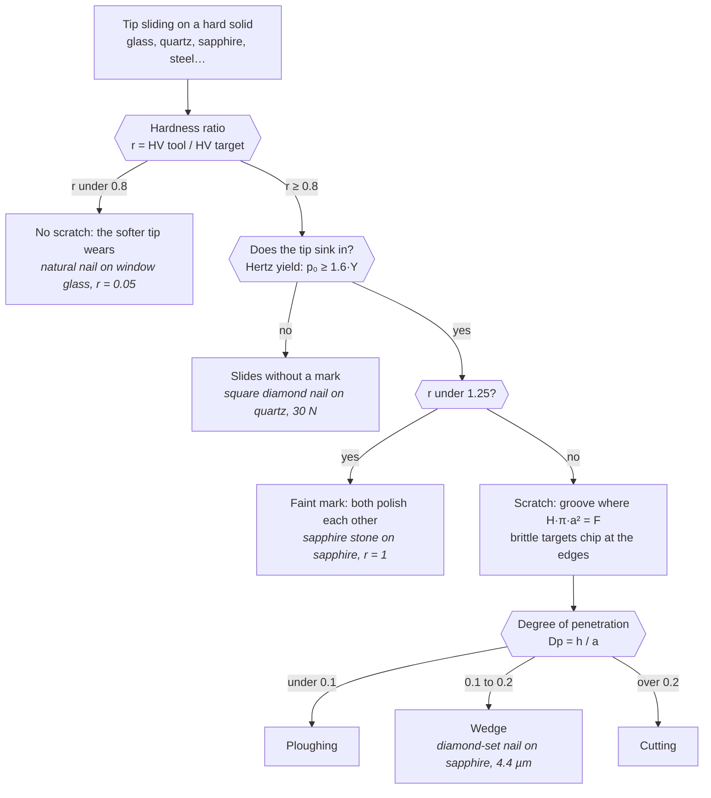

#### Skin: scratch, tear or puncture

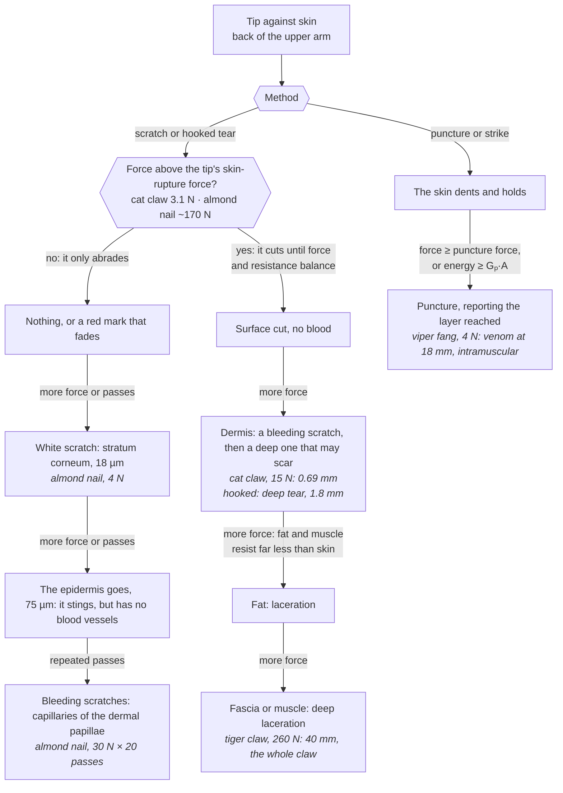

#### Cars: paint first, then the panel

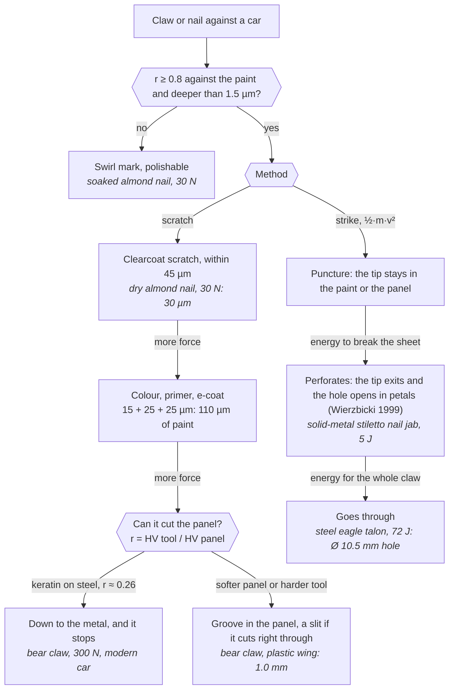

#### Window glass: bending decides

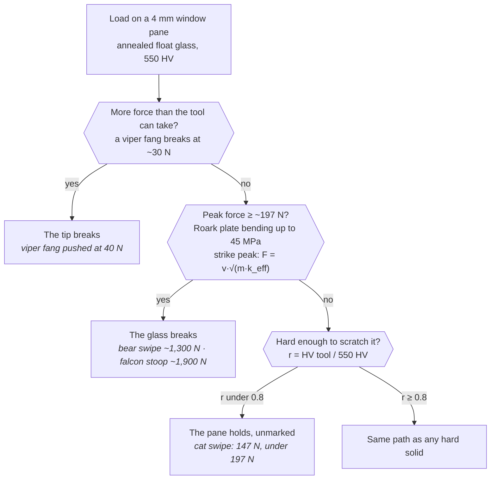

#### Oak door: sharpness beats energy

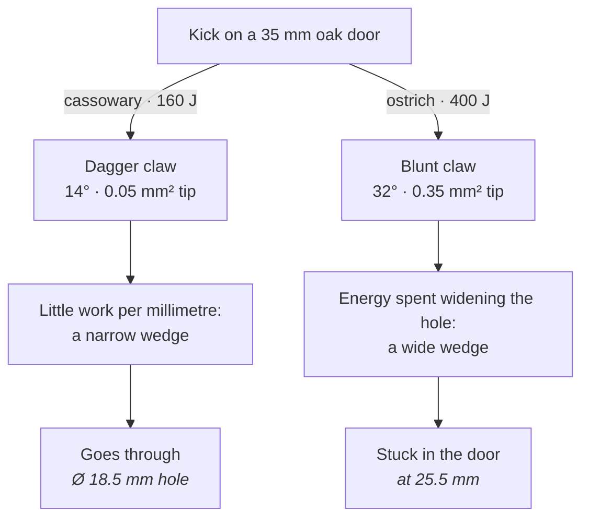

---

## Screenshots

All screenshots were taken from the real desktop build (web view, Chromium), with no mock-ups.

<table>
<tr>
<td width="50%">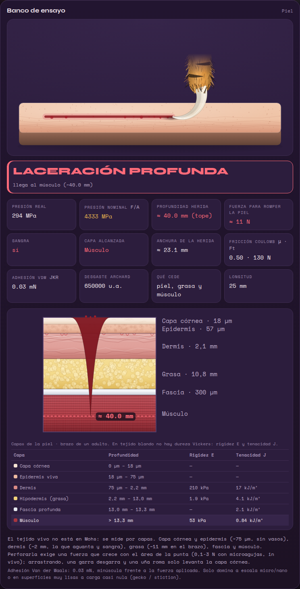</td>
<td width="50%">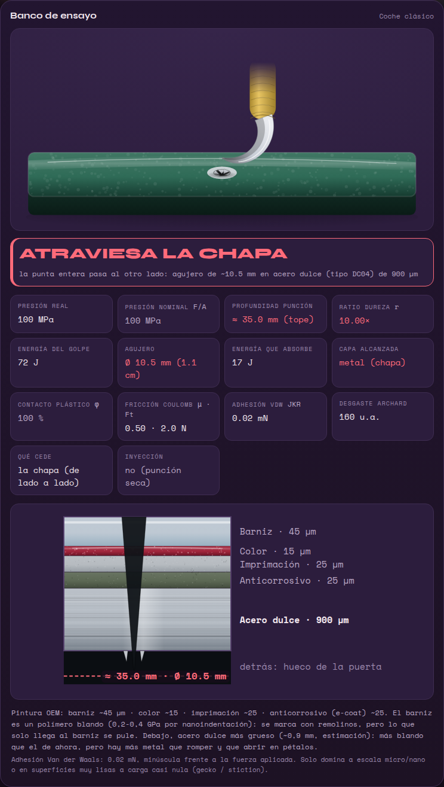</td>
</tr>
<tr>
<td><sub><b>Layered skin.</b> A 260 N tiger swipe: deep laceration to the muscle, as deep as the claw itself.
Real (294 MPa) vs nominal (4,333 MPa) pressure, the force that breaks the skin, and a table of each layer's
stiffness and toughness.</sub></td>
<td><sub><b>Car cross-section.</b> Clearcoat, basecoat, primer and e-coat over 900 µm of mild steel.
The steel talon is buried 35 mm and has opened a 10.5 mm hole.</sub></td>
</tr>
<tr>
<td>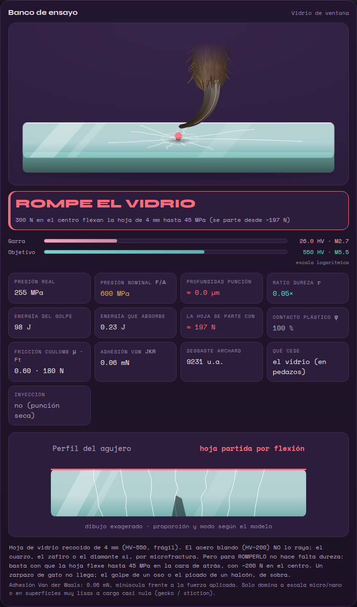</td>
<td>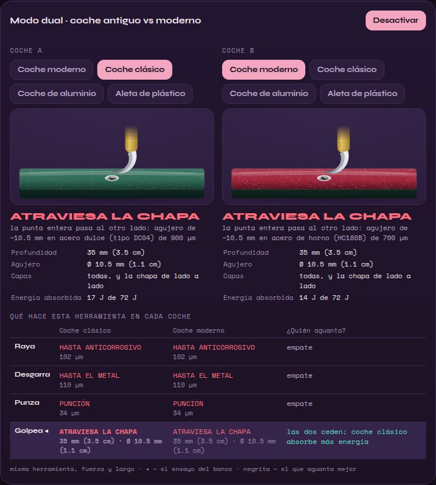</td>
</tr>
<tr>
<td><sub><b>Window glass.</b> A bear claw can't scratch glass (<i>r</i> = 0.05), but it breaks the pane: the
bending stress reaches 45 MPa from ~197 N.</sub></td>
<td><sub><b>Dual mode.</b> The same tool on a classic and a modern car: scratch, tear, puncture and strike,
with the depth in mm and cm, the hole, and which car holds up better.</sub></td>
</tr>
</table>

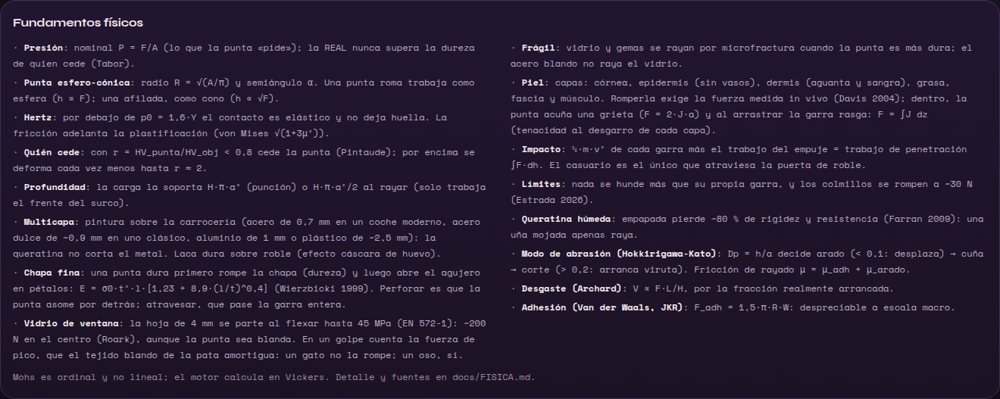
<sub><b>Fundamentals panel</b> (∑ button): the same models as the table above, summarised inside the app.</sub>

---

## How the physics is verified

- **115 automated tests** (`npm test`, Node's built-in runner):
  - **40 golden scenarios** that freeze reference results. A physics change has to regenerate them
    on purpose and explain why.
  - **Physical invariants**:
    - more force never gives less depth;
    - a sharper nail never scratches shallower;
    - depth is continuous across layer boundaries;
    - a strike never penetrates less than a static push;
    - nothing goes deeper than its own claw;
    - keratin never cuts steel;
    - of the whole catalogue, only the cassowary goes through the oak door.
  - **A result contract**: every field the apps display exists and is finite across the whole bench.
  - **Tests for the shared drawings and sounds**: deterministic SVG, no NaN, sounds in sync with the
    mobile WAVs.
- **Full-catalogue sweep** (`npm run audit`, ~20 s): 603,228 runs of every tool × material × method ×
  force × wetness, plus dual mode, with no broken text, non-finite value or impossible depth. The v1 audit of 478,800 combinations had found 90,286 contact
  pressures above the tip's own hardness, which is physically impossible. The v2 model was built to fix
  that.
- **Mobile smoke test**: renders the React Native app with test doubles and walks through a full
  session, including dual mode and a broken window.
- **CI on every pull request**: tests, desktop build, mobile checks, then `rustfmt`, `clippy` and a
  build of the native shell.
- **Honesty rule**: each new value needs a published source, or is labelled an estimate in the app and
  in `docs/FISICA.md`.

---

## Download

Each tagged version (`v*`) is built by GitHub Actions
([`release.yml`](.github/workflows/release.yml)) and published on the
[Releases page](https://github.com/AcidClawX41/Scratch-Tribology-Simulator/releases):

| Platform | File | First launch |
|---|---|---|
| Windows 10/11 | `…_x64-setup.exe` or `…_x64_en-US.msi` | Not code-signed: SmartScreen → *More info* → *Run anyway* |
| macOS, Apple Silicon (M1 and later) | `…_aarch64.dmg` | Not notarized: open it once, then *System Settings → Privacy & Security → Open Anyway* |
| macOS, Intel | `…_x64.dmg` | Same as above |
| Linux | `…_amd64.AppImage` (portable), `.deb`, `.rpm` | AppImage: `chmod +x` and run. NVIDIA: see [`apps/desktop/README.md`](apps/desktop/README.md) |
| Android 7.0+ | `…_android.apk` | Allow *Install unknown apps* for your browser or file manager |
| iPhone / iPad | `…_ios-unsigned.ipa` | Unsigned: install it with AltStore or Sideloadly, which sign it with your Apple ID (free accounts: every 7 days) |

The desktop app is a native Tauri 2 shell (~5–10 MB) around the system WebView. It needs no network
at runtime: fonts are bundled, there are no CDNs and no analytics, under a strict CSP.

---

## Build from source

Requirements: Node 24 (`.nvmrc`), and Rust via [rustup](https://rustup.rs) for the native desktop app.

```bash
npm install            # core + desktop (workspaces)
npm test               # physics engine tests
npm run check          # tests + desktop build + mobile checks and smoke test
npm run audit          # sweep of the whole catalogue (~600,000 runs)
npm run dev            # web version at http://localhost:1420
npm run tauri dev      # native desktop window
npm run tauri build    # installers for the current OS
```

Universal macOS binary (Apple Silicon + Intel) on an M1 or later:

```bash
rustup target add x86_64-apple-darwin
npm run tauri build -- --target universal-apple-darwin
```

Mobile (Expo SDK 52, React Native 0.76.9), installed on its own:

```bash
cd apps/mobile && npm install
npx expo run:ios          # simulator, or --device for your iPhone (Xcode 16.3+)
npx expo run:android      # Android Studio + JDK 17
```

Platform details, signing and first launch: [`apps/desktop/README.md`](apps/desktop/README.md) and
[`apps/mobile/README.md`](apps/mobile/README.md) (both in Spanish).

---

## Project structure

```
packages/core/        physics engine, catalogues, drawings (SVG scene graphs), sounds, lab state
  src/physics.js      compute(): contact, layers, skin, sheets, glass, impact, wear, friction
  src/data.js         nails, stones, claws, materials, paint and skin layers, car bodies
  src/art.js          every illustration, shared by desktop and mobile
  src/sfx.js          synthesized sound effects
  test/               115 tests + golden.json
apps/desktop/         React + Vite + Tauri 2 (macOS, Windows, Linux, web)
apps/mobile/          Expo / React Native (iPhone, iPad, Android)
docs/FISICA.md        physical model, equations, data, estimates and references
docs/ROADMAP.md       planned improvements
.github/workflows/    ci.yml (every PR) · release.yml (installers, APK and IPA)
```

---

## Known limitations

This is an **educational model**. It gets trends and orders of magnitude right; it is not a laboratory
test, nor a forensic or medical tool.

- Depths are **under load**: the elastic recovery of polymers is not modelled.
- Nails are treated as sphero-conical points, not edges. A real stiletto would snap in bending long
  before 30 N, and nail fracture is not modelled.
- Thin sheets: the petals assume ductile fracture and no strain-rate effects. Denting is not modelled:
  a blow that does not perforate would dent the panel. Neither is what lies behind it (reinforcements,
  inner panel).
- Glass: only annealed panes loaded at the centre. Car side windows are tempered and windscreens
  laminated; both break differently. Hertzian cone cracks are not computed, so a blunt, hard tip on
  glass may be reported as elastic where a ring crack could appear.
- Skin: a single reference site (the arm). There is no bone. The skin's elastic recoil and the friction
  on the tip's flanks are ignored.
- Many animal forces and strike masses are estimates, and are labelled as such.

Planned improvements: [`docs/ROADMAP.md`](docs/ROADMAP.md).

---

## License

Scratch Tribology Simulator is released under the [MIT License](LICENSE).
Copyright © 2026 Eric Valls Gramunt.

You may use, copy, modify and redistribute it, commercially or not, as long as the copyright notice
and the license text are kept. It comes with no warranty.

The apps bundle third-party software under their own licenses: the Syne and Space Mono fonts under the
SIL Open Font License 1.1, plus React, Tauri, Expo and React Native, which are MIT or Apache-2.0. The
details and the full font license are in [`THIRD-PARTY-NOTICES.md`](THIRD-PARTY-NOTICES.md). The
scientific sources cited in [`docs/FISICA.md`](docs/FISICA.md) belong to their authors and publishers.

---

## Author

**Eric Valls Gramunt** · [@AcidClawX41](https://github.com/AcidClawX41)
